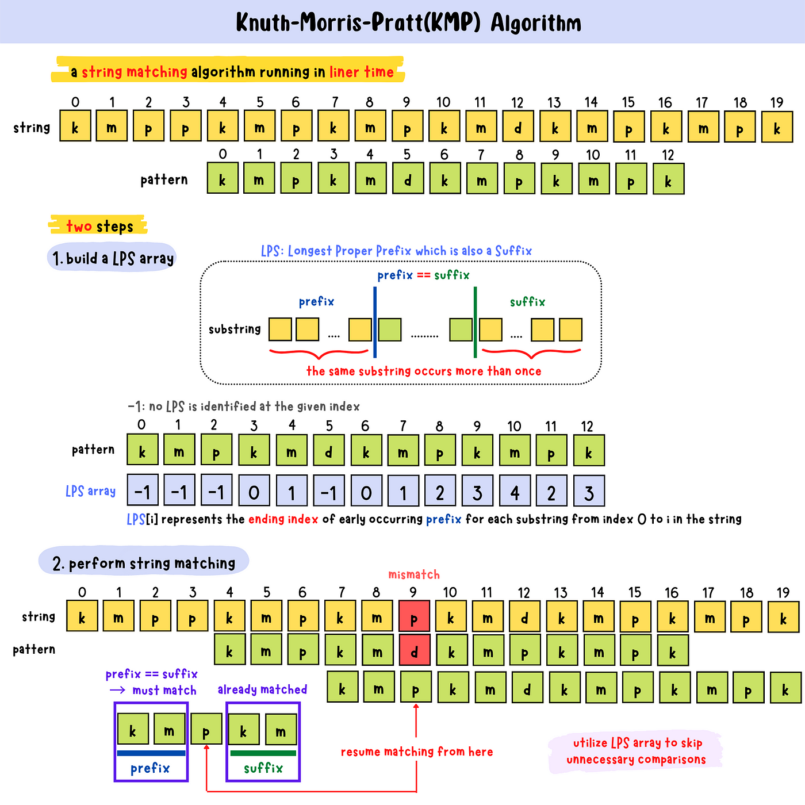

## 背景

字符串匹配问题是指对于字符串s和字符串p，查找字符串p在字符串s中出现的位置。

对于朴素的算法，时间复杂度为O(mn)，一种优化方式是字符串哈希，通过O(n)的预处理，可以O(1)的复杂度判断字符串s中长度为p.size()的子串是否和p相等，
但是哈希的问题在于哈希碰撞带来的不确定性。

KMP(Knuth-Morris-Pratt)算法可以实现在O(n+m)的时间复杂度下找出字符串p在字符串s中出现的所有位置。

## 原理




## 代码实现
### 下标从0开始
```cpp
void KMP(std::string& s, std::string& p) {
    int n = s.size(), m = p.size();
    std::vector<int> nxt(m+1);
    std::vector<int> f(n+1);
    nxt[1] = 0;
    int j = 0;
    for (int i = 2; i <= m; ++i) {
        while (j > 0 && p[j] != p[i-1])
            j = nxt[j];
        if (p[j] == p[i-1]) j++;
        nxt[i] = j;
    }

    j = 0;
    for (int i = 1; i <= n; ++i) {
        while ((j == m) || (j > 0 && p[j] != s[i-1]))
            j = nxt[j];
        if (p[j] == s[i-1]) j ++;
        f[i] = j;
        if (f[i] == m) std::cout << i - m + 1 << '\n';
    }
    for (int i = 1; i <= m; ++i)
        std::cout << nxt[i] << " \n"[i == m];
}
```
### 下标从1开始
```cpp
#include <iostream>
#include <vector>
#include <cstring>

char s[1000002];
char p[1000002]; // 下标从1开始+末尾终结符

void KMP(char* s, char* p) {
    int n = strlen(s+1);
    int m = strlen(p+1);

    std::vector<int> nxt(m+1);
    std::vector<int> f(n+1);

    nxt[1] = 0;
    int j = 0;
    for (int i = 2; i <= m; ++i) {
        while (j > 0 && p[j+1] != p[i])
            j = nxt[j];
        if (p[j+1] == p[i]) j++;
        nxt[i] = j;
    }
    j = 0;
    for (int i = 1; i <= n; ++i) {
        while ((j == m) || (j > 0 && p[j+1] != s[i]))
            j = nxt[j];
        if (p[j+1] == s[i]) j ++;
        f[i] = j;
        if (f[i] == m) std::cout << i - m + 1 << '\n';
    }
    for (int i = 1; i <= m; ++i)
        std::cout << nxt[i] << " \n"[i == m];
}

int main() {
    std::ios::sync_with_stdio(false);
    std::cin.tie(nullptr);    

    scanf("%s", s+1);
    scanf("%s", p+1);

    KMP(s, p);
}
```
> Reference: https://www.bilibili.com/video/BV1CY4y14751

> Written by Jiacheng Hu, at Zhejiang University, Hangzhou, China.