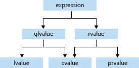

# 理解万能引用 | 左值引用 | 右值引用

> 在写C++代码时，被万能引用、左值引用和右值引用的问题困扰了很久，于是花了点时间整理了相关概念，并做了一个总结
> 

## 左值和右值

> The original definition of lvalues and rvalues from the earliest days of C is as follows: An *lvalue* is an expression `e` that may appear on the left or on the right hand side of an assignment, whereas an *rvalue* is an expression that can only appear on the right hand side of an assignment.
> 

最初，左值和右值的概念来自C，左值是可以出现在赋值语句左侧和右侧的表达式，右值是仅能出现在赋值语句右边的表达式

```cpp
int a = 42;
int b = 43;

// a and b are both lvalues:
a = b; // ok
b = a; // ok
a = a * b; // ok

// a * b is an rvalue:
int c = a * b; // ok, rvalue on right hand side of assignment
a * b = 42; // error, rvalue on left hand side of assignment
```

> 左值右值不仅仅指一个变量，严格来说是指一个表达式，例如 x++、a*b；事实上对编译器来说，一个变量也被当作一个表达式

在之后的C++中，由于引入了面向对象特性以及更为复杂的赋值方式，左值右值的概念进行了拓展；尽管很难对左值右值下一个准确的定义，但是在绝大多数情况下，可以通过下面的方法对二者进行区分：

> An *lvalue* is an expression that refers to a memory location and allows us to take the address of that memory location via the `&` operator. An *rvalue* is an expression that is not an lvalue
> 

左值是拥有一个程序可以访问的地址的表达式，允许我们通过 & 运算符获取该地址；如果一个表达式不是左值，那它就是右值
```cpp
int i, j, *p;
// Correct usage: 
// the variable i is an lvalue and the literal 7 is a rvalue.
i = 7;
// Incorrect usage: 
// The left operand must be an lvalue (C2106). `j * 4` is a rvalue.
7 = i; // C2106
j * 4 = 7; // C2106
// Correct usage: the dereferenced pointer is an lvalue.
*p = i;
// Correct usage: the conditional operator returns an lvalue.
((i < 3) ? i : j) = 7;
// Incorrect usage: the constant ci is a non-modifiable lvalue (C3892).
const int ci = 7;
ci = 9; // C3892
```
> If the type of an expression is an lvalue reference (e.g., `T&` or `const T&`, etc.), that expression is an lvalue.
> 

特别注意，左值引用和常量左值引用也是左值（无论是否为临时对象，比较反直觉），而右值引用可以是左值也可以是右值，区别在于是否是临时对象

事实上C++中有一个专门的词*value category*，用来形容表达式的左右值特性，同时对此进行了更为具体的划分(since C++17)

- glvalue：广义左值
- rvalue：右值
- lvalue：左值
- xvalue：将亡值
- prvalue：纯右值



由于*value category*的细节比较复杂，详细内容可以参考下面的链接：

[Value Categories: Lvalues and Rvalues (C++)](https://learn.microsoft.com/en-us/cpp/cpp/lvalues-and-rvalues-visual-cpp?view=msvc-170)

[Value categories - cppreference.com](https://en.cppreference.com/w/cpp/language/value_category)

Reference：

[C++ Rvalue References Explained](http://thbecker.net/articles/rvalue_references/section_01.html)

## 左值引用和右值引用

### 左值引用

> If`X`is any type, then`X&`is called an *lvalue reference* to`X`. 
It holds the address of an object but behaves syntactically like an object
> 

左值引用可以被当作一种替代指针的*syntax sugar*，但是由于其声明时必须绑定一个对象，且不可以更换绑定对象，因此相比裸指针具有更强的内存安全保障；同时左值引用被用作拷贝构造和拷贝赋值

```cpp
class Window {
public:
    Window( const Window& );            // Declare copy constructor.
    Window& operator=(const Window& x); // Declare copy assignment.
    // ...
};
```

左值引用可以绑定左值，不可以绑定常量左值和右值

常量左值引用可以绑定左值、常量左值和右值

```cpp
int a = 1;
const int b = 1;
int& c = 1; // incorrect
int& d = a; // correct
int& e = b; // incorrect
const int& f = a; // correct
const int& g = b; // correct
const int& h = 1; // correct
```

### 右值引用

> If`X`is any type, then`X&&`is called an *rvalue reference*to`X`
> 

右值引用可以理解为绑定右值的引用，且右值引用仅能绑定右值

> Rvalue references enable you to distinguish an lvalue from an rvalue
> 

右值引用的引入基于两种需求

#### 移动语义

当人们希望将对象B赋值给对象A时，左值引用带来的拷贝特性能够帮助实现这一功能；但是为了提升效率，当对象B在赋值给对象A之后就不再被使用，那么完全可以将对象B的资源转移给对象A（底层通过指针的方式实现），进而避免拷贝的资源消耗，人们称之为移动语义；需要注意，在将对象B的资源转移给对象A后，就不应该再使用对象B

我们可以通过移动构造和移动赋值两种方式实现移动语义

```cpp
class Window {
public:
    Window(Window&& ) noexcept;            // Declare move constructor.
    Window& operator=(Window&& x) noexcept; // Declare move assignment.
    // ...
};
```

#### 完美转发

> Perfect forwarding reduces the need for overloaded functions and helps avoid the forwarding problem. The *forwarding problem* can occur when you write a generic function that takes references as its parameters. If it passes (or *forwards*) these parameters to another function, for example, if it takes a parameter of type `const T&`, then the called function can't modify the value of that parameter. If the generic function takes a parameter of type `T&`, then the function can't be called by using an rvalue (such as a temporary object or integer literal).
> 

完美转发可以帮助人们解决转发问题：

考虑一种情况，现在我们需要将一个右值作为参数传入函数，在没有右值引用的情况下该如何实现？

首先左值引用无法绑定右值，因此无法使用左值引用；常量左值引用尽管可以绑定右值，但是由于常量，在函数体中就无法对参数进行修改

```cpp
// forward的具体实现，本质是类型转换
template<typename _Tp>
constexpr _Tp&& forward(typename std::remove_reference<_Tp>::type& __t) noexcept
{ return static_cast<_Tp&&>(__t); }
```

基于上面两种需求，人们需要一种新的不同于左值引用的方式，使得能够实现移动语义和完美转发，因此也就引入了右值引用

Reference：

[Lvalue reference declarator: &](https://learn.microsoft.com/en-us/cpp/cpp/lvalue-reference-declarator-amp?view=msvc-170)

[Rvalue reference declarator: &&](https://learn.microsoft.com/en-us/cpp/cpp/rvalue-reference-declarator-amp-amp?view=msvc-170)

[谈谈完美转发(Perfect Forwarding)：完美转发 = 引用折叠 + 万能引用 + std::forward](https://zhuanlan.zhihu.com/p/369203981)

[Copy constructors - cppreference.com](https://en.cppreference.com/w/cpp/language/copy_constructor)

[Move constructors - cppreference.com](https://en.cppreference.com/w/cpp/language/move_constructor)

## 万能引用和引用折叠

声明右值引用使用的符号为`&&`，但是使用`&&`符号的却不一定是右值引用，这也是C++程序中非常令人困惑的一点

```cpp
Widget&& var1 = someWidget;      // here, “&&” means rvalue reference
 
auto&& var2 = var1;              // here, “&&” does not mean rvalue reference
 
template<typename T>
void f(std::vector<T>&& param);  // here, “&&” means rvalue reference
 
template<typename T>
void f(T&& param);               // here, “&&”does not mean rvalue reference
```

> The essence of the issue is that “`&&`” in a type declaration sometimes means rvalue reference, but sometimes it means *either* rvalue reference *or* lvalue reference. As such, some occurrences of “`&&`” in source code may actually have the meaning of “`&`”, i.e., have the syntactic *appearance* of an rvalue reference (“`&&`”), but the *meaning* of an lvalue reference (“`&`”).
> 

在一些时候，`&&` 既可以绑定左值，也可以绑定右值，人们称其为万能引用(universal reference)

注：事实上在cpp reference中，并没有universal reference的称呼，其中共定义了四种引用，分别是lvalue reference、rvalue reference、forwarding reference以及dangling reference，其中forwarding reference就是universal reference，可以参考下面链接中的回答

[Is there a difference between universal references and forwarding references?](https://stackoverflow.com/questions/39552272/is-there-a-difference-between-universal-references-and-forwarding-references)

- 什么时候`&&` 表示万能引用

> If a variable or parameter is declared to have type **`T&&`** for some **deduced type** `T`, that variable or parameter is a *universal reference*.
> 

如果一个变量或者参数被声明为**T&&**，其中T是**被推导**的类型，那这个变量或者参数就是一个万能引用，形如`auto&&` 、`T&&` ，注意T需要是被推导的类型

例如下面的例子：

```cpp
template<typename T>
void f(T&& param);               // deduced parameter type ⇒ type deduction;
                                 // && ≡ universal reference
 
template<typename T>
class Widget {
    ...
    Widget(Widget&& rhs);        // fully specified parameter type ⇒ no type deduction;
    ...                          // && ≡ rvalue reference
};
 
template<typename T1>
class Gadget {
    ...
    template<typename T2>
    Gadget(T2&& rhs);            // deduced parameter type ⇒ type deduction;
    ...                          // && ≡ universal reference
};
 
void f(Widget&& param);          // fully specified parameter type ⇒ no type deduction;
                                 // && ≡ rvalue reference

// push_back can’t exist without the class std::vector<T> that contains it.  
// But if we have a class std::vector<T>, we already know what T is
// so there’s no need to deduce it.
template <class T>
class vector {
public:
    ...
    void push_back(T&& x);       // fully specified parameter type ⇒ no type deduction;
    ...                          // && ≡ rvalue reference
};

template <class T, class Allocator = allocator<T> >
class vector {
public:
    ...
    template <class... Args>
    void emplace_back(Args&&... args); // deduced parameter types ⇒ type deduction;
    ...                                // && ≡ universal references
};
```

- 万能引用什么时候表示左值？什么时候表示右值？
    - If the expression initializing a universal reference is an lvalue, the universal reference becomes an lvalue reference. (T& && → T&)
    - If the expression initializing the universal reference is an rvalue, the universal reference becomes an rvalue reference. (T && → T&&而不是T&& && → T&&)

此时我们可以发现一个问题，参考如下代码

```cpp
template<typename T>
void f(T&& param);
...
int x;
...
f(10);                           // invoke f on rvalue
f(x);                            // invoke f on lvalue
```

此时对于`f(10)`来说，T被推导为`int`，也就是`void f(int&& param)`，但是对于`f(x)`，根据万能引用规则，T被推导为`int&` ，也就是`void f(int& && param)`，`& &&` 这样的引用声明看上去并不合法；为了解决这个问题，C++标准引入了引用折叠的概念

> It is permitted to form references to references through type manipulations in templates or typedefs, in which case the *reference collapsing* rules apply: rvalue reference to rvalue reference collapses to rvalue reference, all other combinations form lvalue reference:
> 

```cpp
typedef int&  lref;
typedef int&& rref;
int n;
 
lref&  r1 = n; // type of r1 is int&
lref&& r2 = n; // type of r2 is int&
rref&  r3 = n; // type of r3 is int&
rref&& r4 = 1; // type of r4 is int&&
```

至此，万能引用的类型推断就变的合法了

Reference：

[Universal References in C++11 -- Scott Meyers : Standard C++](https://isocpp.org/blog/2012/11/universal-references-in-c11-scott-meyers#NittyGrittyDetails)

[Reference declaration - cppreference.com](https://en.cppreference.com/w/cpp/language/reference)

## 常见误区 🌟

### 某个变量的类型是左值右值

> Every C++ expression has a type, and belongs to a *value category*. The value categories are the basis for rules that compilers must follow when creating, copying, and moving temporary objects during expression evaluation.
> 

左值右值不是一种类型，而是*value category*，通常是用于帮助编译器选择如何对一个对象进行创建/赋值/移动

> the lvalueness or rvalueness of an expression is independent of its type. Consider the type `int`.  There are lvalues of type `int` (e.g., variables declared to be `int`), and there are rvalues of type `int` (e.g., literals like `10`).
> 
### 使用右值引用一定可以减少内存拷贝

严格意义上讲，减少内存拷贝的是移动语义，而不是右值引用；右值引用的目的是为了实现移动语义，但是使用右值引用不代表就实现了移动语义

> 如果没有实现移动构造和移动赋值会发生什么？
> 

如果一个类没有实现移动构造和移动赋值，但使用了移动语义，那么move会退化成copy；需要注意在一些情况下编译器会生成默认移动构造和默认移动赋值函数

### 左值引用类型的变量是左值，右值引用类型的变量是右值；函数的参数为左值/右值引用类型，他们在函数体中就是左值/右值

> The compiler treats a named rvalue reference as an lvalue and an unnamed rvalue reference as an rvalue
> 
左值右值和类型是独立的概念，一个右值引用类型的变量可以是左值，将右值引用作为参数的函数会将该参数视为函数体中的左值；一个右值引用类型的变量也可以是右值，比如print(forward<int>(x))的结果为print(int &&)，int &&为临时变量，故为右值


具体见下面的例子：

```cpp
template<typename T>
void print(T& t){
    cout << "lvalue" << endl;
}
template<typename T>
void print(T&& t){
    cout << "rvalue" << endl;
}

template<typename T>
void TestForward(T&& v){
    print(v); // 任何的函数内部，对形参的直接使用，都是按照左值进行的
    print(std::forward<T>(v));
    print(std::move(v));
}

int main(){
    TestForward(1); // int && -> int && ，T为int，v是右值引用类型
    int x = 1;
    TestForward(x); // int& && -> int &，T为int&，v是左值引用类型
    TestForward(std::forward<int>(x)); // int && -> int &&，T为int，v是右值引用类型
		// forward<int>(x)得到的是临时变量，类型为int &&，进入TestForward, T为int
    return 0;
}
/* 
Output：
lvalue
rvalue
rvalue

lvalue
lvalue
rvalue

lvalue
rvalue
rvalue
*/
```

> Written by Jiacheng Hu, at Zhejiang University, Hangzhou, China.