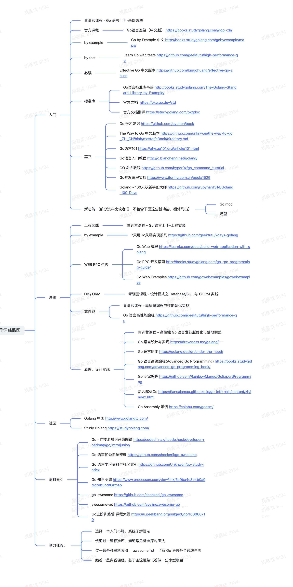

# 如何学习Golang

## 快速入门：

[Go by Example 中文版](https://gobyexample-cn.github.io/)

## 小项目：

[7天用Go从零实现分布式缓存GeeCache](https://geektutu.com/post/geecache.html)

## Go语言设计与实现：

[Go 语言设计与实现](https://draveness.me/golang/)

## Go语言圣经：

[Go语言圣经](https://books.studygolang.com/gopl-zh/)

## Go学习路线：

[字节跳动Go语言学习路线图](https://bytedance.feishu.cn/docs/doccn3SFTuFIAVr4CDZGx48KKdd)

> Written by Jiacheng Hu, at Zhejiang University, Hangzhou, China.
